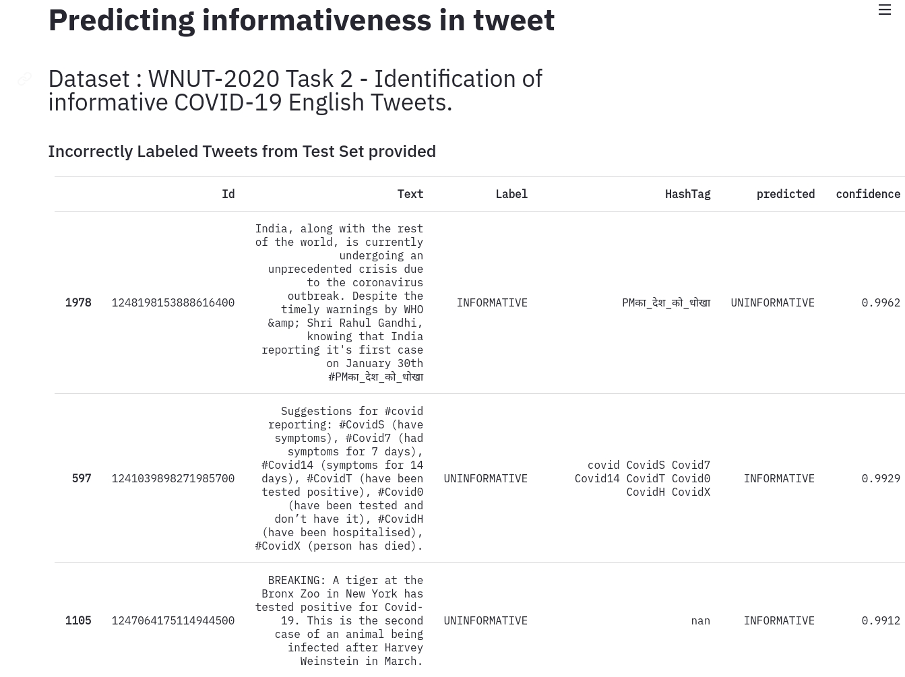

# fastclean

> Experiments to find incorrect labels in the dataset and noisy training

## Motivation

- Large public and real world datasets can have incorrect labels. These large datasets are hand labeled using human-annotation such as Mechanical Turks or even generated by automated systems based on user actions rather than explicitly added by experts.  In case of medical domains,  the time spent by specialists or experts for labeling is highly expensive.  Hence there is a tradeoff between cost of labeling and the quality of the labels.

- Using deep learning models trained on these large datasets containing noisy labels can cause the model to overfit on these incorrect labels impacting the performance measure. Also test set used to determine the performance measure should be without any label errors.

- It is critical to detect the extent of mislabeling, identify the noisy indices and take corrective actions. The corrective actions could include removing the noisy labels, correcting the noisy samples or make the model more robust to noisy labels in order to improve the performance.


## Notebooks

- 01 - Training using Noisy Imagenette.
  - In this notebook noisy imagenette[1] is used to perform experiments and compare the techniques on various noise levels ranging 1/5/25/50 percent levels. This contains a subset of images from Imagenet on 10 different classes. Please refer[1] on the generation of noisy labels. In order to effectively compare the evaluation, the validation set is clean & the labels are not changed.
  - Training using Resnet 18 and Resnet 34 with Gradual Unfreezing.
  - Detecting Noise Indices in the training data using Confident Learning using Cleanlab
  - Pseudo Labeling using High Confident Predictions as soft targets
- 02 - Training MNIST with LabelSmoothing using CleanLab and reproduce the result.
- 03 - Text Classification on Covid Tweets to identify the informativeness. 
- 04 - Integrate fastai Intepretation module with cleanlab to identify and review the noisy labels in training, validation and test dataset.

## Scripts

- Noisy Imagenette : fsdl/train.py
- Covid Tweets : fsdl/covidtweets.py

## Outputs

- Noisy Labels detected from Imagenette with & without LabelSmoothing
- Data Directory

```bash
├── imagenette_labelsmoothing
│   ├── prune_noise_rate
│   │   ├── noisy25_train_predictions.csv
│   │   ├── noisy50_train_predictions.csv
│   │   └── noisy5_train_predictions.csv
│   └── prune_noise_rate_class
│       ├── noisy25_train_predictions.csv
│       ├── noisy50_train_predictions.csv
│       └── noisy5_train_predictions.csv
└── imagenette_no_labelsmoothing
    ├── prune_noise_rate
    │   ├── noisy25_train_predictions.csv
    │   ├── noisy50_train_predictions.csv
    │   └── noisy5_train_predictions.csv
    └── prune_noise_rate_class
        ├── noisy25_train_predictions.csv
        ├── noisy50_train_predictions.csv
        └── noisy5_train_predictions.csv
```

- Covid Tweets : Noisy Labels Detected from Test Data can be viewed using Streamlit

 

```
covid
├── noisy
    └── noisy_text.csv

```

## Experiments

### Noisy Imagenette

- ResNet 34 Pretrained with ImageNet
- Experiment Tracking using Weights & Biases


| Noice Percent | Actual Noisy samples | Noise with Label Smoothing ( prune by noise rate) | Noise with Label Smoothing ( prune by noise rate + class ) | Noise with CrossEntropy (prune by noise rate) | Noise with CrossEntropy (prune by noise rate + class) |
|-|-|-|-|-|-|
| 5% | 114 | **117**| 76 | 431 | 406 |
| 25% | 2122 | **2177** | 2023 | 2217 | 2140 |
| 50% | 4092 | 4256 | **4132** | 4257 | 4151 |

## StreamLit

- ![Watch the demo of Covid Informativeness on Noisy Tweet Dataset]

## References

- [1] https://tmabraham.github.io/blog/noisy_imagenette
- [2] Confident Learning: Estimate Uncertainty in Dataset Labels
[WNUT-2020 Task 2: Identification of informative COVID-19 English Tweets](https://competitions.codalab.org/competitions/25845)